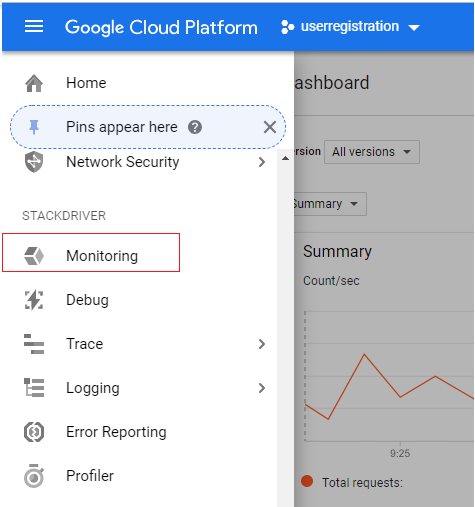
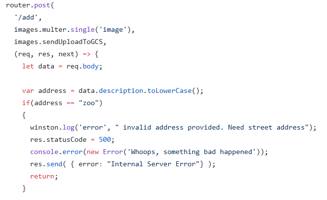
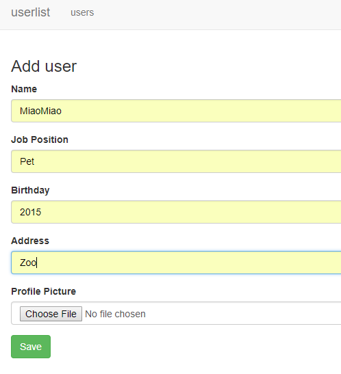
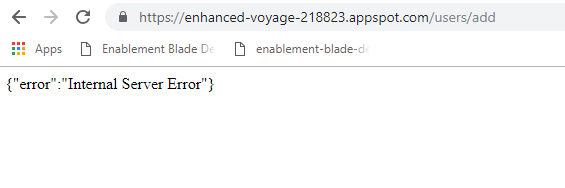
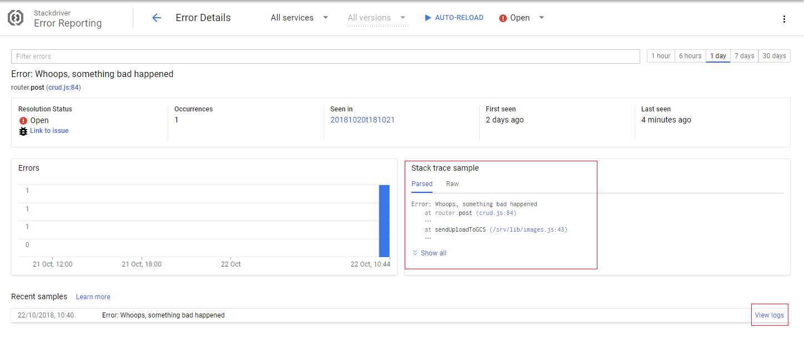

# Stackdriver Diagnostics Experience for User Registration Node.js web app on GCP

## Pre-requisite
* 	• Install google cloud SDK command line interface: https://cloud.google.com/sdk/

## Deploy rocessImage-GCF

1. Create GCP project: https://cloud.google.com/resource-manager/docs/creating-managing-projects
2. Create a storage bucket.  Set default access policy to public:
    ```
    gsutil defacl set public-read gs://[YOUR-BUCKET-NAME]
    ```
3. 	(Optional) Create the topic that triggers the Cloud function. If you don't create it, a default one will be created when creating the Cloud function.

4. 	Open processImage-GCF project. In index.js, change the following lines with the bucket name and project id:
```
const storage = new Storage({
projectId: 'Project_Id'
}
);
```

5. In command prompt, change current context to the project you created to deploy the project
```
gcloud config list
gcloud config set project [project_id]
```

6. Change directory to the processImage_GCP folder, deploy to Google cloud function

```
	gcloud functions deploy imagePubSub --runtime nodejs8 --trigger-resource [Storage_Bucket_Name] --trigger-event google.pubsub.topic.publish

```

## Deploy UserList
1. In UserList project, go to config.json, change the values for GCLOUD_PROJECT, CLOUD_BUCKET, and TOPIC_NAME. Note that DATA_BACKEND will be named datastore as the default datastore used by App Engine:

```
{
"GCLOUD_PROJECT": "project_id",
"DATA_BACKEND": "datastore",
"CLOUD_BUCKET": "bucket_name",
"TOPIC_NAME": "topic_name"
}

```

2. Change command prompt directory to UserList project and deploy the proejct to App Engine:
```
gcloud app deploy
```

3. Browse to the application to view, add, delete users.

    

## Enable Stackdriver on the project

1. Navigate to the project in https://console.cloud.google.com/
2. On the navigation menu, choose Monitoring under STACKDRIVER

    

3. Follow instruction to finish enabling stackdriver. Skip AWS and VM integration sections

## Create an error in the application
There are code in the web app that deliberately create errors. Let's hit the error code and see how to use Stackdriver to debug the error.

Code that creates error in users/crud.js:

    

1. Navigate to the web app. Choose to add new user
2. Fill out user information. Enter 'Zoo' for address. Click 'Save'

    

3. The web app will throw Internal Server error message

    

4. Go to Stackdriver error reporting. Depending on how you configured Stackdriver, a notification via email, slack, text message, or other methods should have been sent to you

    

5. Click into the Error to debug using stack trace and logs

    
